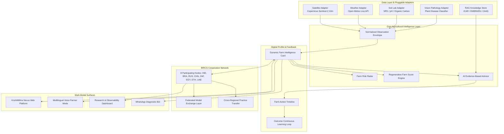

# KRISHIMITHRA NEXUS
### *"One intelligence layer. Many farming nations."*
#### Inspired by the BRICS AgriN Digital Public Good Framework

---

## 🌾 Overview

**KrishiMithra Nexus** transforms agricultural intelligence from a generic chatbot into an **interoperable digital public infrastructure network** for climate-resilient agriculture. Addressing the BRICS Theme (**Agricultural Cooperation & Digital Public Good**), KrishiMithra Nexus unifies:

- 🛰️ **Satellite Farm Monitor**: Multispectral Sentinel-2 & Copernicus NDVI, NDWI, EVI, and spectral anomaly reasoning.
- 🌦️ **Climate Forecast & Consequence Engine**: Real-time Open-Meteo meteorology converted into operational agricultural decisions (spray feasibility, disease risk, irrigation delays).
- 🧪 **Soil Health & Diagnostic Lab**: Real-time NPK, pH, and Organic Carbon diagnostic scoring with targeted biological and organic amendments.
- 🌿 **Regenerative Agriculture Engine**: 5-factor Regenerative Farm Score (Soil, Water, Diversity, Carbon, Resilience) and 3-step prioritized score-gain roadmaps.
- 🤖 **Evidence-Based AI Agro-Advisor**: Structured 5-part reasoning: *What is happening*, *Why it may be happening*, *What you should do*, *Confidence*, and *Peer-reviewed citations*.
- 📚 **Agricultural RAG Knowledge Center**: Indexed peer-reviewed research from ICAR (India), EMBRAPA (Brazil), CAAS (China), ARC (South Africa), and FAO.
- 🤝 **BRICS Cooperation Layer & Model Exchange**: "Cooperation without Centralization"—sharing specialized models and cross-regional climate analog practices (e.g. Alternate Wetting & Drying, Biochar Stubble Pelleting, Biological Nitrogen Fixation).
- 🎙️ **Multilingual Farmer Voice Mode**: High-contrast, large-touch, voice-first interaction in 10 languages (Kannada, Hindi, Telugu, Tamil, Marathi, Bengali, English, Portuguese, Russian, Chinese).
- 🎯 **Farm Risk Radar & Action Timeline**: Low/Medium/High severity multi-factor risk radar with Day 0 to Day 7 action timelines.
- 🔄 **Farm Outcome Feedback Loop**: Continuous responsible AI learning and ground-truth validation.
- 📊 **AI Observability & Admin Telemetry**: Context Precision, Context Recall, Faithfulness, and Latency tracking.

---

## 🏛️ System Architecture



---

## 🛡️ Data Honesty Protocol

KrishiMithra Nexus enforces strict data transparency. Every data point is tagged with an explicit provenance badge:

| Badge Type | Icon | Meaning & Data Source |
| :--- | :---: | :--- |
| **Live Connected API** | 🟢 📡 | Direct live API (Open-Meteo High-Resolution Agro Forecast) |
| **Public Dataset** | 🔵 🗄️ | Verified open satellite & research feeds (Sentinel-2 Level-2A BOA, ICAR, EMBRAPA) |
| **Simulated Regional Feed** | 🟡 ⚙️ | Calibrated simulation modeling specific agro-climatic zones |
| **Demo Scenario Data** | 🟣 🧪 | Pre-configured realistic scenarios for judging and demonstration |

---

## 🚀 Key Modules & Capabilities

### 1. Farm Intelligence Card & Risk Radar
- Dynamic multi-modal profile for farms across Karnataka (India), Mato Grosso (Brazil), Krasnodar (Russia), and Heilongjiang (China).
- **Risk Radar**: Real-time evaluation of Disease Risk, Water Stress, Heat Risk, Rainfall Risk, Soil Risk, and Crop Stress.

### 2. Satellite Farm Monitor
- Calculates NDVI, NDWI (canopy moisture), EVI, and Chlorophyll absorption.
- Anomaly reasoning: *"NDVI decreased 15.9% while NDWI is stable ➔ indicates foliar lesion outbreak (Rice Blast), ruling out drought stress."*
- Calibrated uncertainty scoring (e.g. ±12%).

### 3. Climate Forecast & Consequence Engine
- Connects to live Open-Meteo API.
- Converts raw metrics into operational consequences:
  - *Irrigation*: Delay scheduled puddle flooding before forecasted 18mm rain.
  - *Disease Alert*: 88% humidity + 21-30°C triggers fungal blast sporulation alert.
  - *Spray Window*: Restricted due to high wind / precipitation risk.

### 4. Soil & Regenerative Agriculture Engine
- Interactive diagnostic sliders for pH, Nitrogen (N), Phosphorus (P), Potassium (K), Organic Carbon (OC %), and EC.
- **Regenerative Farm Score (0-100)** broken down by:
  - Soil Health (25%)
  - Water Efficiency (20%)
  - Crop Diversity (20%)
  - Organic Matter & Carbon (20%)
  - Climate Resilience (15%)
- Top 3 prioritized score-gain actions with safe biological amendments (Azospirillum, biochar, green manure).

### 5. Evidence-Based AI Agro-Advisor
- Structured 5-part evidence breakdown:
  1. **WHAT IS HAPPENING**
  2. **WHY IT MAY BE HAPPENING (Evidence Triangulation)**
  3. **WHAT YOU SHOULD DO (Action Roadmap)**
  4. **CONFIDENCE SCORE**
  5. **DATA SOURCES & PEER-REVIEWED CITATIONS**

### 6. BRICS Cooperation Network & Model Exchange
- Visual federated node graph (India, Brazil, Russia, China, South Africa, Egypt, Ethiopia, UAE).
- **Cross-Regional Practice Transfer**: e.g., Chinese Alternate Wetting and Drying (AWD) applied to Indian rice for 25% water conservation and root aeration.
- **Model Exchange Registry**: Open model cards with accuracy, parameter counts, license, and interactive cross-border API execution sandboxes.

### 7. Agricultural RAG Knowledge Center
- Indexed peer-reviewed extension bulletins and scientific papers.
- Semantic & keyword hybrid search with direct chunk relevancy scoring and DOI citations.

### 8. Multilingual Farmer Voice Mode
- High-contrast, large-touch, voice-first interface.
- Web Speech API integration (Speech-to-Text & Text-to-Speech) supporting Kannada, Hindi, Telugu, Tamil, Marathi, Bengali, English, Portuguese, Russian, and Chinese.

### 9. AI Observability & Health Telemetry
- RAG Context Precision (94.8%), Context Recall (91.6%), Faithfulness (96.2%), Answer Relevance (93.5%), and latency telemetry.

---

## ⚡ Quickstart Guide

### Prerequisites
- Node.js 18+
- npm

### 1. Frontend Setup
```bash
cd frontend
npm install
npm run dev
```
Open `http://localhost:5173` in your browser.

### 2. Backend Setup
```bash
cd backend
npm install
npm run dev
```
Backend API gateway runs on `http://localhost:3001`.

### 3. Running with Docker Compose
```bash
docker-compose up --build
```

---

## 🏆 2-Minute Judging Walkthrough

1. Open the platform and click **"2-Min Judge Demo Tour"** in the top navigation bar.
2. Watch the automated 8-stage sequence:
   - **Stage 1**: Farm profile & soil baseline.
   - **Stage 2**: Sentinel-2 satellite vegetation stress (-15.9% NDVI drop).
   - **Stage 3**: Weather consequence engine (88% humidity alert).
   - **Stage 4**: Computer vision leaf pathology diagnosis (91.4% confidence).
   - **Stage 5**: RAG peer-reviewed ICAR research retrieval.
   - **Stage 6**: Evidence-based structured AI advisory generation.
   - **Stage 7**: Cross-regional practice transfer from BRICS network.
   - **Stage 8**: Action timeline and farmer outcome feedback loop.

---

## 📄 License & Digital Public Good
Built as an open digital public infrastructure prototype for climate-resilient agriculture under the MIT / Apache 2.0 Open Source licenses.
